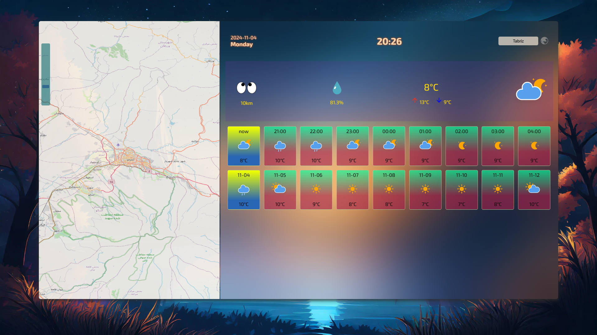

### آب و هوای هر منطقه 
> ### [click for see project ...](https://alireza-shokri.github.io/weather/)

api های استفاده شده
-  https://api.api-ninjas.com !====>
برای دسترسی به ساعت هر منطقه
-  https://weather.visualcrossing.com !====>آب و هوای هر منطقه
- http://api.weatherapi.com !====>نام شهر 

کتابخانه
- OpenLayers !

alireza shokri :)
